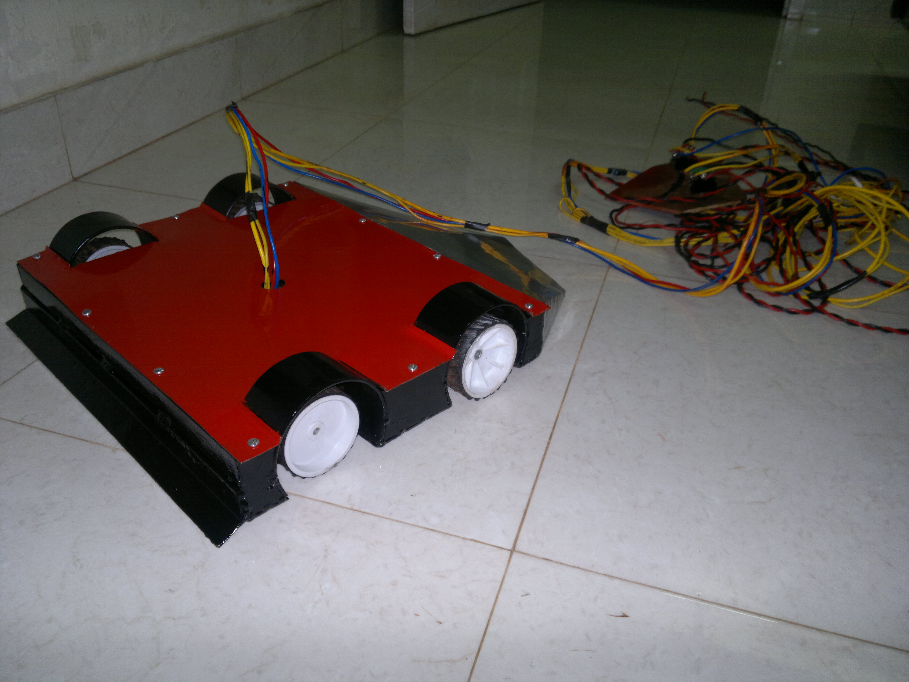
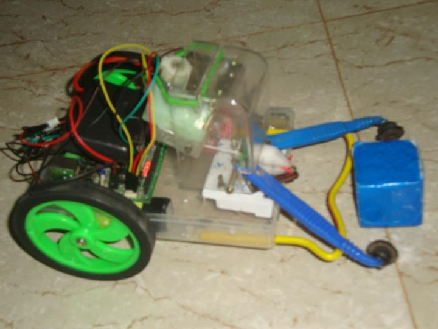
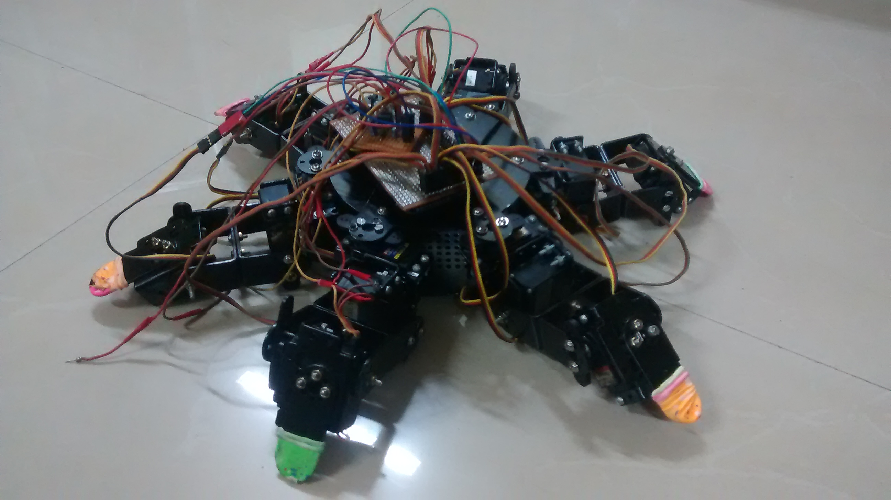
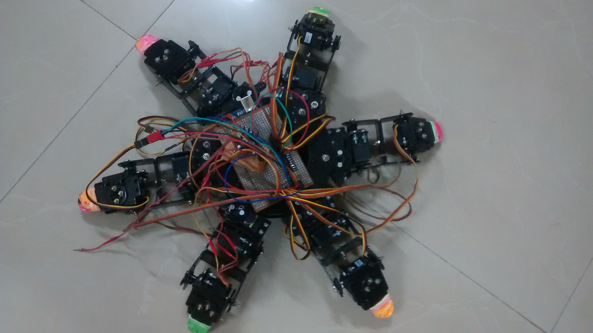

### 👋 Hi, I'm Virat Chourasia

Tech founder | Backend & Distributed Systems Engineer | Robotics tinkerer

I’m the Chief Tinkerer at [AISuraksha](https://www.aisuraksha.in), an AI-first insurance assistant that helps families understand coverage, prevent fraud, and navigate claims - part of India’s next-gen insurance infrastructure. I’ve previously built real-time systems, semantic search engines, cloud-native microservices, and even a Braille hand glove for the visually impaired.

### Currently building:
- Playing with RAG (Retrieval-Augmented Generation) for insurance-specific Q&A
- Exploring GPU programming and model optimization for inference workloads
- Experimenting with building small language models (SLMs) for domain-specific reasoning

### Robotics & Embedded systems (Throwback projects)
#### Robowars Finalist (2012)
Built a Lambo-style bot using wiper motors, scrap steel, and a 12V car battery. Reached semi-finals.

  

#### Vision-Guided Bots at NIT-K & IIT-B
Team lead for camera-based bots using microcontrollers and CC2500 modules.

  
  

#### All-Terrain Hexapod Robot (Final Year)
Programmed gait and terrain adaptation for a six-legged robot.

  
  

### More
- [aisuraksha.in](https://www.aisuraksha.in) – Landing Page  
- [aisuraksha.ai](https://www.aisuraksha.ai) – Live AI Summarizer  
- [Medium Blog](https://medium.com/@viratc) – Writings & Ideas  

Checkout my work, experiments, and hacks — and feel free to connect!

<!--
**viratc/viratc** is a ✨ _special_ ✨ repository because its `README.md` (this file) appears on your GitHub profile.

Here are some ideas to get you started:

- 🔭 I’m currently working on ...
- 🌱 I’m currently learning ...
- 👯 I’m looking to collaborate on ...
- 🤔 I’m looking for help with ...
- 💬 Ask me about ...
- 📫 How to reach me: ...
- 😄 Pronouns: ...
- ⚡ Fun fact: ...
-->
